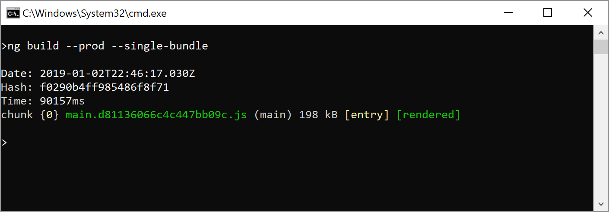

# Building Web Components with Angular Elements and the CLI

# Content

In this article you will learn:

- How to provide a single bundle for your Angular Elements
- How Ivy can help with bundle sizes (once it's released) and where it cannot
- How to share dependencies between separately compiled Angular Elements
- How differential serving can help (not only) with Angular Elements

[Source Code](http://TODO)

Currently, Angular Elements officially supports exposing Angular Components as Web Components -- or more precisely: as Custom Elements -- **within** Angular projects. Upcoming versions will very likely also support exporting Web Components which can be used with other frameworks or VanillaJS. I'm using the term _external_ web component for referring to this.

In this article, I provide several strategies you can use to provide external web components already today. Some of them will definitely benefit from the introduction of Ivy in some months and some of them address different aspects. 

One more time, I want to thank [Rob Wormald](https://twitter.com/robwormald) -- the father and master mind behind Angular Elements -- for discussions that led to some of those inofficial solutions.

## Initial Situation

The example used here is a variation of the dashboard tile component from my [introduction to Angular Elements](https://www.softwarearchitekt.at/post/2018/07/13/angular-elements-part-i-a-dynamic-dashboard-in-four-steps-with-web-components.aspx):

It can be found [here](http://TODO) and consists of a CLI workspace with two projects. One of them called ``dashboard-tile`` exposes a simple dashboard tile as an external component:


The code behind it is quite simple:

```typescript
@Component({
  // selector: 'app-external-dashboard-tile',
  templateUrl: './external-dashboard-tile.component.html',
  styleUrls: ['./external-dashboard-tile.component.css']
})
export class ExternalDashboardTileComponent implements OnInit {

  @Input() src: number = 1;
  
  a: number;
  b: number;
  c: number;

  constructor(private http: HttpClient) {
  }

  ngOnInit(): void {
    this.load();
  }

  load() {
    this.http.get(`/assets/stats-${this.src}.json`).subscribe(
      data => {
        this.a = data['a'];
        this.b = data['b'];
        this.c = data['c'];
      }
    );
  }

  more() {
    this.src++;
    if (this.src > 3) {
      this.src = 1;
    }
    this.load();
  }

}
```

In order to provide this component as a custom element when the Angular application starts up, the respective code is placed in the ``AppModule``'s ``ngDoBootstrap`` method:

```typescript
@NgModule({
   imports: [
      HttpClientModule,
      BrowserModule
   ],
   declarations: [
      ExternalDashboardTileComponent
   ],
   bootstrap: [],
   entryComponents: [
      ExternalDashboardTileComponent
   ]
})
export class AppModule { 
    constructor(private injector: Injector) {
    }

    ngDoBootstrap() {
        const externalTileCE = createCustomElement(ExternalDashboardTileComponent, { injector: this.injector });
        customElements.define('external-dashboard-tile', externalTileCE);
    }

}
```

Here, ``ngDoBootstrap`` is needed because the application does not have a bootstrap component. This is because I don't want to bootstrap an ordinary Angular component but just register a custom element with the browser.

In theory, you should be able to call the web component directly within the ``index.html`` after exposing it that way.

```
<external-dashboard-tile src="1"></external-dashboard-tile>
```

In practice, you get the following error when trying this out with the starter branch of the provided source code:

> Failed to construct 'HTMLElement': Please use the 'new' operator, this DOM object constructor cannot be called as a function.


This is because Custom Elements are to be used with EcmaScript 2015 and above by definition. However, in order to support legacy browsers like Internet Explorer, TypeScript has to downlevel it to EcmaScript 5. Although this might change in the future, currently EcmaScript 5 is the default setting when creating an Angular project with the CLI. To tweak this, you can set the property ``target`` in your ``tsconfig.json`` to ES5.

Of course, this solution is not doable if you are in the unfortunate situation where you have to support Internet Explorer. A lot of my customers face this as a company policy and hence, they have to find a way to at least officially run it in this browser of Microsoft's former days.

In this case, we need to go with two polyfills: One polyfill enables web components in browsers that DO NOT support custom elements; the other one enables using them together with EcmaScript 5 in browsers that DO support them.

## Polyfills 

In order to also support old browsers, I've decided to go with the polyfills in the ``@webcomponents/custom-elements`` package. Unfortunately, they cannot be used within the same bundle. Hence, I've copied them over to the ``assets`` folder and referenced them in a classic way:

```html
<script src="./assets/custom-elements/src/native-shim.js"></script>
<script src="./assets/custom-elements/custom-elements.min.js"></script>
```

To automate this cumbersome task, I've written a schematic which is part of my community project ``ngx-build-plus``:

```
ng add ngx-build-plus --project dashboard-tile
ng g ngx-build-plus:wc-polyfill --project dashboard-tile
```

The called schematic creates an npm script which copies over the polyfills and executes it. It also updates the ``index.html`` with the two ``script`` tags shown above.

After starting the solution (``npm start``) you should see something like this in Chrome:


To make this work with Internet Explorer, we also have to uncomment the imports for the respective polyfills in the ``polyfill.ts``:

```typescript
[...]
/** IE9, IE10 and IE11 requires all of the following polyfills. **/
import 'core-js/es6/symbol';
import 'core-js/es6/object';
import 'core-js/es6/function';
import 'core-js/es6/parse-int';
import 'core-js/es6/parse-float';
import 'core-js/es6/number';
import 'core-js/es6/math';
import 'core-js/es6/string';
import 'core-js/es6/date';
import 'core-js/es6/array';
import 'core-js/es6/regexp';
import 'core-js/es6/map';
import 'core-js/es6/weak-map';
import 'core-js/es6/set';
[...]
```

Angular Elements comes with another polyfill that is registered within your ``angular.json`` when installing it with ``ng add @angular/elements``. This one is far more lightweight than the one I'm using here. However, it just can be used with browsers supporting EcmaScript 2015 and above. Hence, when you don't need to target Internet Explorer, this one should be prefered. 

## Build

Now, let's create a bundle for our web component using ``ng build``:

```
ng build --prod
```

This gives us 4 (!) bundles:


While this is ok for an ordinary SPA, it's far too much for a simple web component. In our case, having just one self-contained bundle would be better.

My above mentioned community project ``ngx-build-plus`` provides  a simple solution for this with its ``--single-bundle`` switch:

```
ng build --prod --single-bundle
```

After running this, we get one and only one bundle as wished:



An alternative to ``--single-bundle`` you see sometimes is manually copying the four bundles into one file. Unfortunately, this does not work if you have more than one such meta-bundle. The reason is that webpack is exposing a global variable and this would get overwritten when using several such bundles that have been compiled separately. 

Please note, that you need to reference the ``CUSTOM_ELEMENTS_SCHEMA`` in your respective modules if you want to use a custom element within an Angular Component:

```typescript
@NgModule({
  declarations: [
    AppComponent
  ],
  imports: [
    BrowserModule
  ],
  providers: [],
  schemas: [CUSTOM_ELEMENTS_SCHEMA],
  bootstrap: [AppComponent]
})
export class AppModule { }
```

When you look at the bundle sizes, you immediately realize that they are far to huge for such a simple web component. This is where Ivy comes in.

## Ivy

Beginning with Angular 8 we will get the new Ivy compiler. In this version, it will be hidden behind a flag. It makes Angular more tree-shakable and compiles the UI part of components down to code which is quite close to the DOM. For this reason, typical web components will benefit a lot from Ivy and the resulting bundle won't need much of Angular. 

**In the best case,** two separately generated bundles with Angular Elements will look like this:


They just contain their component code and a very tiny remainder of Angular which acts as the runtime. As mentioned: in the best case!

However, while Ivy has a lot of potential, we should not expect wonders like [Minko Gechev](https://twitter.com/mgechev) who is now part of the Angular Team told us at twitter:


Especially, if our components contain lots of libraries besides UI code, Ivy will not help much. Or to put it in another way: It cannot make the used parts of things like ``@angular/forms`` or ``@angular/common/http`` disappear.

In this case, we very likely need to find a way to share such dependencies among separately built bundles. This leads to the idea in the next section.

## Sharing Libraries

**This and the next section describe a quite advanced process to share libraries between separately compiled Angular Elements. Make sure you really need this solution before implementing it.**

In order to share libraries like ``@angular/common/http`` which is used in our above shown Angular Element, we could load them into the browser's global scope and reuse them in our web component bundles:


This is something that was quite usual some years ago. Think about using jQuery. We needed to load jQuery and jQuery UI once and the bundles with our jQuery widgets just referenced them.

However, Angular projects are normally built into several bundles that only know each other and other bundles cannot easily access their code. 

To solve this issue, Angular's [Rob Wormald](https://twitter.com/robwormald) came up with a interesting idea: Let's tweak the build process so that the generated bundles expect the shared libraries not to be part of them but are located within the global scope. In order to make this possible, we need to find a way to put Angular and its dependencies there. 

Fortunately, the Angular packages format prescribes to expose Angular libraries also as UMD bundles and they do this job. In the case of Angular itself, they register themselves at ``window.ng.core``, ``window.ng.common``, etc.

This involves a lot of manual steps I've automated with another schematic. Because this changes a lot of things, I've created an own branch for this in my demo project. It's called ``external``.

If you want to try it out by yourself, I would also branch the starter branch for this:

```
git branch -c demo
```

Than, call this command:

```
ng g ngx-build-plus:externals --project dashboard-tile
```

To compile everything, use this npm script generated by ``ngx-build-plus``:

```
npm run build:dashboard-tile:externals
```

After this, you can switch to your ``dist`` folder and try out your solution:

```
npm i -g live-server
cd dist
cd dashboard-tile
live-server
```


If you want to prepare an Angular application that hosts such a custom element, you can use the ``--host`` switch. E. g. the demo project contains a ``playground-app`` which could be prepared using

```
ng g ngx-build-plus:externals --project playground-app --host
```

This command is more or less doing the same as the command without ``--host``. However, it does not switch to a single bundle or turn off hashes in file names.

There is also an npm script ``copy:ce`` which copies over the ``dashboard-tile`` bundle to the ``playground-app`` where it can be dynamically loaded. 

To dynamically load the dashboard tile, it creates a script tag which points to the bundle. The code for this can be found in the example app. 


## Behind the covers

Now, let's talk about what happened here. The schematic we've executed created a partial webpack configuration, which defines where the shared libraries can be found within the browser's ``window`` object.

```javascript
const webpack = require('webpack');

module.exports = {
    "externals": {
        "rxjs": "rxjs",
        "@angular/core": "ng.core",
        "@angular/common": "ng.common",
        "@angular/common/http": "ng.common.http",
        "@angular/platform-browser": "ng.platformBrowser",
        "@angular/platform-browser-dynamic": "ng.platformBrowserDynamic",
        "@angular/compiler": "ng.compiler",
        "@angular/elements": "ng.elements",
        "@angular/router": "ng.router",
        "@angular/forms": "ng.forms"
    }
}
```

If you npm install a newer version of Angular, just run the following script it also inserted into your ``package.json``:

```
npx-build-plus:copy-assets
```

In addition, the schematic also copied over a lot of UMD bundles into the ``assets`` folder and it referenced them within the ``index.html``:

```html
<!-- core-js for legacy browsers 
    Consider only loading for IE
-->
<script src="./assets/core-js/core.js"></script>

<!-- Zone.js 
    Consider excluding zone.js when creating
    custom Elements by using the noop zone.

    If you load zone.js with an additional 
    bundle, delete this line.
-->
<script src="./assets/zone.js/zone.js"></script>

<!-- Rx -->
<script src="./assets/rxjs/rxjs.umd.js"></script>

<!-- Angular Packages -->
<script src="./assets/core/bundles/core.umd.js"></script>
<script src="./assets/common/bundles/common.umd.js"></script>
<script src="./assets/common/bundles/common-http.umd.js"></script>
<script src="./assets/elements/bundles/elements.umd.js"></script>

<!-- Just needed for prod mode -->
<script src="./assets/platform-browser/bundles/platform-browser.umd.js"></script>
```

As an alternative, you can also consider to put those UMD-bundles into one or several meta-bundles. 


## Differential Serving

Something which is still annoying is the fact, we need a polyfill even for browsers that DO support custom elements if we want to support ES5-browsers like Internet Explorer. This issue can be solved with differential serving. That means, we are creating two sets of bundles: One set is EcmaScript 2015+ based and indented for modern browsers and the other one is EcmaScript 5 based and loaded into Internet Explorer. 

By doing this, we can also ship more optimized bundles to the modern browsers: They don't need to contain all the polyfilly and they don't need to be downleveled to ES5 which makes them smaller.

If you have implemented the externals idea described in the two previous sections, switch now back to your former branch. Externals and Differential Serving cannot be used together for now.

In some future version, the Angular CLI will very likely support differential serving. Until then, we can use my community project ``ngx-build-modern`` which is nothing else than a plugin for ``ngx-build-plus``:

```
ng add ngx-build-modern --project dashboard-tile
```

After adding it with ``ng add``, we get a ``polyfills.modern.ts`` file alongside the already known ``polyfills.ts``. As the name implies, the former one will be used for modern browsers and the existing one will be used for legacy products like Internet Explorer. 

Now, we can finally remove the polyfill for browsers that DO support web components as they get now EcmaScript 2015+ served.

```html
<!-- Polyfills for Browsers supporting 
      Custom Elements. Needed b/c we downlevel
      to ES5. See: @webcomponents/custom-elements
<script src="./assets/custom-elements/src/native-shim.js"></script>
-->
```

Unfortunately, when debugging we currently get ES 5, so the following hack is necessary:

```html
<script>
if (window['customElements'] && !environment.production) {
    document.write('<script src="/assets/custom-elements/src/native-shim.js"></script>')
}
</script>
```

To build everything, switch to your project's root and run the following npm script created by the ``ngx-build-modern`` schematic before:

```
npm run build:modern
```

If you switch to the folder ``dist/dashboard-tile`` you should see two sets of bundles:


As you see here, the modern bundles are about 88 KB smaller. They contain less polyfills and are more compact due to not having the need of downleveling to ES5. In general you will see: the bigger the project, the bigger the difference between modern and legacy bundles.

The ``index.html`` contains the necessary markup to load the right set of bundles. For loading modern bundles it uses this pattern:

```html
<script type="module" src="[...].modern.ec2944dd8b20ec099bf3.js"></script>
```

Because of using ``type="module"`` this is only respected by modern browsers. 

The bundles for legacy browsers are loaded that way:

```html
<script type="text/javascript" src="main.legacy.d9ef9dc1b2c49e5eb049.js" nomodule="">
```

The ``nomodule`` attribute makes modern browsers to ignore it.

To test your solution, run ``live-server`` again.


